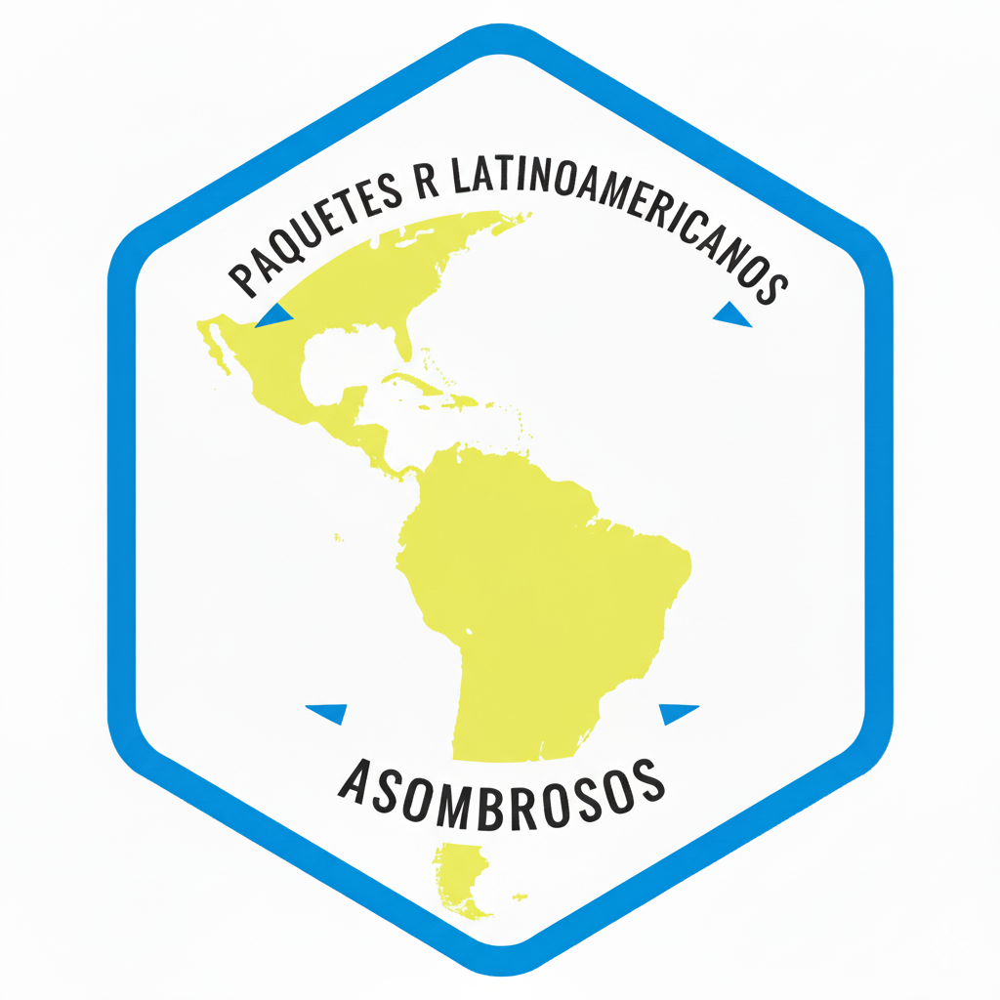

<div align="center">



# Asombrosos Paquetes de R Latinoamericanos

Una lista curada de paquetes R desarrollados por personas de Latinoamérica  
para el acceso, procesamiento, visualización y comunicación de datos.

[](data/paquetes.yaml)
[](#)
[](CONTRIBUTING.md)
[](http://creativecommons.org/licenses/by/4.0/)

**🚀 [Explorá el catálogo interactivo](https://connect.posit.cloud/estacionr/content/01a01b3b-6f6f-dc53-6f10-a43f944b71e0)**

</div>

---

## ¿Qué es esto?

Un proyecto de la comunidad para visibilizar el trabajo de personas latinoamericanas en el ecosistema R. Inspirado en los proyectos [awesome-*](https://github.com/sindresorhus/awesome) de GitHub.

Un paquete entra al catálogo si:

- ✅ Es de código abierto (licencia libre)
- ✅ Está disponible para instalar (CRAN, GitHub u otro)
- ✅ Tiene documentación accesible
- ✅ Fue desarrollado por alguien de Latinoamérica

---

## Contenidos

- [🏛️ Datos Oficiales](#️-datos-oficiales)
- [🗺️ Datos Espaciales](#️-datos-espaciales)
- [🔧 Tratamiento de Datos](#-tratamiento-de-datos)
- [📊 Modelado](#-modelado)
- [🎨 Visualización](#-visualización)
- [📁 Datasets](#-datasets)
- [📚 Enseñanza](#-enseñanza)
- [🗳️ Política y Elecciones](#️-política-y-elecciones)
- [☁️ Clima y Meteorología](#️-clima-y-meteorología)
- [💰 Economía](#-economía)
- [🧬 Bioinformática](#-bioinformática)

---

## ➕ Cómo agregar un paquete

¿Conocés un paquete R hecho por alguien de Latinoamérica que no está en la lista? ¡Proponelo!

### Opción 1: Issue en GitHub ⭐ La más fácil

1. Abrí un [nuevo issue](https://github.com/Estacion-R/asombrosos-paquetes-r-latinoamerica/issues/new/choose)
2. Elegí la plantilla **"📦 Proponer un paquete"**
3. Completá los campos y enviá — revisamos todos los lunes

### Opción 2: Pull Request

Editá [`data/paquetes.yaml`](data/paquetes.yaml) agregando una entrada con este esquema:

```yaml
- nombre: nombre_del_paquete
  url: https://url-de-documentacion.com
  descripcion: Descripción breve en español (1–2 oraciones).
  autor: Nombre Apellido
  pais: Argentina
  categoria: 1
  hexlogo: https://url-del-hexlogo.png   # opcional
  vigente: true
```

Abrí el PR con el título `feat: agregar [nombre-del-paquete]`.

**Información necesaria**

| Campo | Requerido |
|---|---|
| Nombre del paquete | ✅ |
| URL de documentación (CRAN, GitHub, pkgdown…) | ✅ |
| Descripción breve en español (1–2 oraciones) | ✅ |
| Autor/es y país | ✅ |
| URL del hexlogo | Opcional |

### Opción 3: Escribinos

Si preferís no usar GitHub, podés contactarnos por correo o redes sociales y nosotros nos encargamos de sumarlo:

- ✉️ **Mail:** [pablotiscornia@estacion-r.com](mailto:pablotiscornia@estacion-r.com)
- 🐦 **X/Twitter:** [@estacion_erre](https://twitter.com/estacion_erre)
- 💼 **LinkedIn:** [Estación R](https://www.linkedin.com/company/estacion-r)

Más detalles en [CONTRIBUTING.md](CONTRIBUTING.md).

---

## Licencia

[](http://creativecommons.org/licenses/by/4.0/)

Este trabajo tiene licencia [Creative Commons Attribution 4.0 International](http://creativecommons.org/licenses/by/4.0/).

---

<div align="center">
Hecho con ❤️ por <a href="https://estacion-r.com">Estación R</a>
</div>
